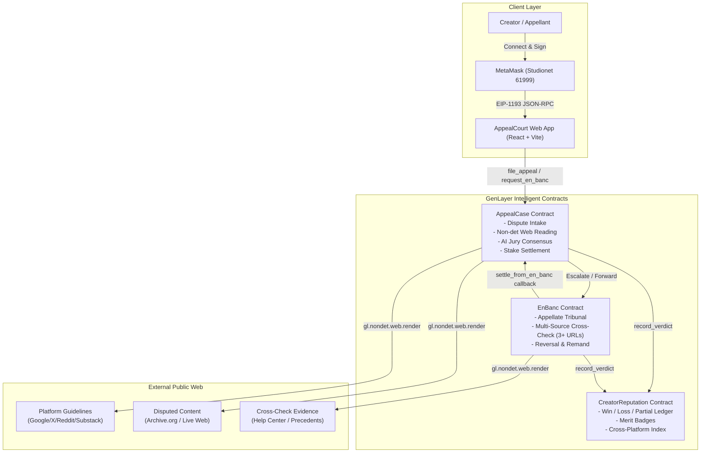
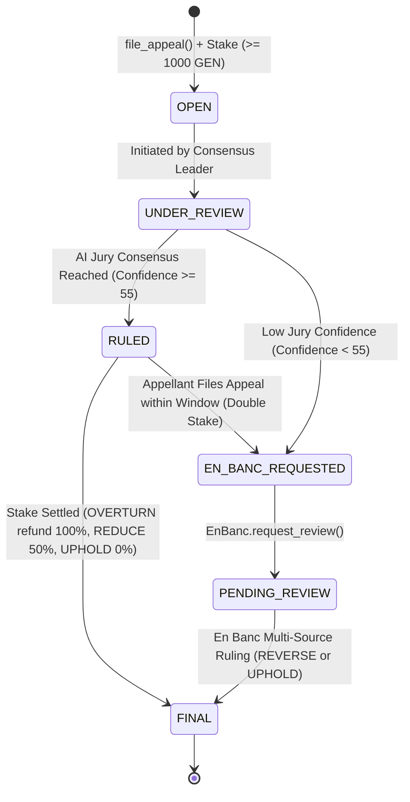
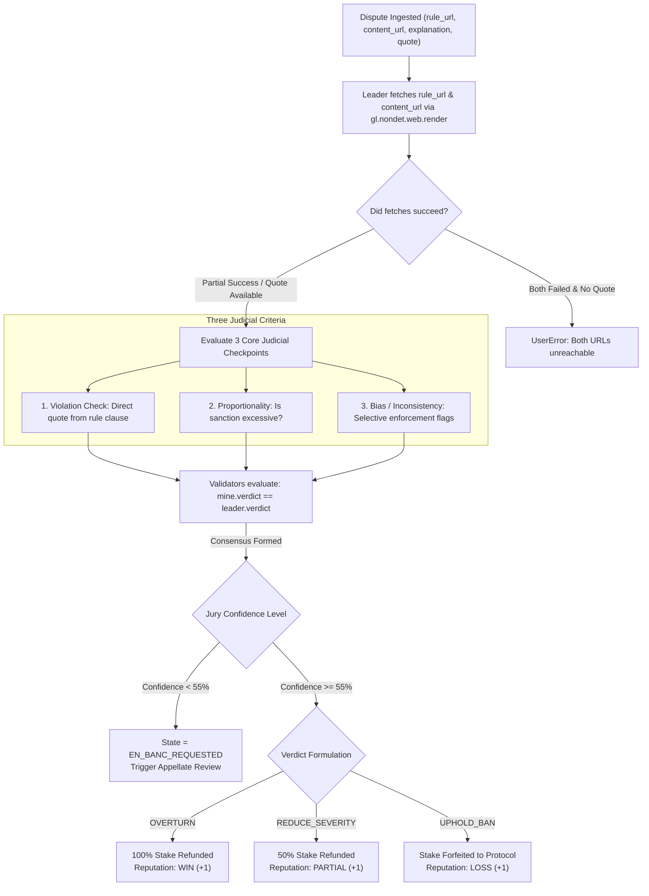

# AppealCourt System Architecture

AppealCourt is a decentralized content moderation adjudication protocol built on GenLayer Intelligent Contracts. It provides an objective, immutable on-chain tribunal where creators facing opaque platform penalties (takedowns, demonetization, strikes, bans) can stake native tokens (`GEN`) for an AI jury consensus review that reads live platform guidelines and published content on-chain.

---

## 1. Multi-Contract System Topology

---

## 2. Adjudication State Machine

---

## 3. Decision Tree: Non-Deterministic AI Jury Adjudication

---

## 4. Contract Authority & Security Model

| Contract | State Mutation Method | Access Control / Authority |
|---|---|---|
| `CreatorReputation` | `set_authorized(caller, allowed)` | Only Admin |
| `CreatorReputation` | `record_verdict(appellant, platform, result)` | Only Authorized Contracts (`AppealCase`, `EnBanc`) or Admin |
| `EnBanc` | `set_dependencies(appeal_case, rep_contract)` | Only Admin |
| `EnBanc` | `request_review(...)` | Public Payable (requires `stake * 2`) |
| `EnBanc` | `admin_seed_review(...)` | Only Admin |
| `AppealCase` | `set_dependencies(en_banc, rep_contract)` | Only Admin |
| `AppealCase` | `file_appeal(...)` | Public Payable (requires `msg.value >= min_stake`, https URLs) |
| `AppealCase` | `request_en_banc(...)` | Public Payable (requires double stake) |
| `AppealCase` | `settle_from_en_banc(...)` | Only `EnBanc` Contract or Admin |
| `AppealCase` | `admin_seed_case(...)` | Only Admin |

---

## 5. Storage Optimization & GenVM Type Safety

- **Storage Layout:** All dynamic mappings utilize `TreeMap[str, T]` with strictly stringified keys (`appellant_addr`, `case_id`).
- **Numeric Precision:** Monetary stakes utilize native `bigint` to prevent numeric overflow. Bounded counters and metrics (`round`, `confidence`) use sized types (`u8`, `u256`).
- **Zero Raw Primitives in Storage:** Storage classes (`Case`, `EnBancReview`) are decorated with `@allow_storage @dataclass`. Bare `int`, `dict`, and `list` are completely prohibited within contract storage fields.
